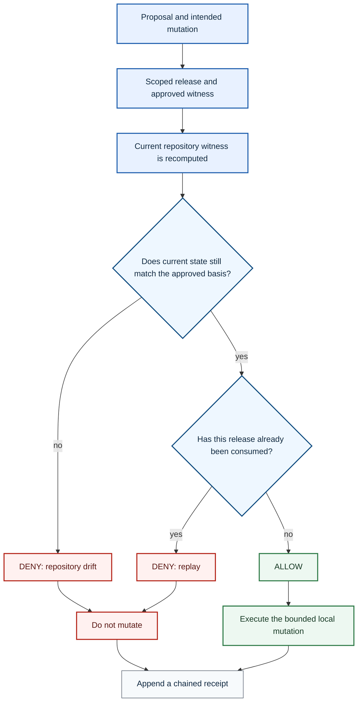

# DETERMA Governed Execution Demo


**A small public proof that recomputes execution legitimacy immediately before mutation.**

AI-generated changes are moving from suggestion to mutation. The risk is not only incorrect intent generation. Authority can become stale between approval and execution.

```text
approval happened earlier
execution happens now
state changed in between
```

## Repository Boundary

| Dimension | Classification |
|---|---|
| Repository role | Public minimal governed-execution demo |
| Environment | Local controlled proof |
| Authority effect | Local demo decision only |
| External mutation | Out of scope |
| Production readiness claim | None |

## Governed Execution Architecture



### Demonstrated paths

- **Valid execution:** the current witness matches the approved witness and the release has not been consumed.
- **Drift denial:** repository state differs from the approved basis before write.
- **Replay denial:** a second attempt reuses an already consumed release.
- **Evidence:** every path appends a receipt to the local receipt history.

## Core Claim

```text
recompute legitimacy immediately before mutation
then ALLOW or DENY
```

## Run the Demo

```bash
git clone https://github.com/DETERMAai/determa-governed-execution-demo.git
cd determa-governed-execution-demo
./scripts/run_demo.sh
```

Expected observations:

```text
scenario=valid
decision=ALLOW
reason=witness_match
mutation_executed=yes
```

```text
scenario=drift
decision=DENY
reason=repository_drift
mutation_blocked=yes
```

```text
scenario=replay-second
decision=DENY
reason=replay
mutation_blocked=yes
```

## Threat Demonstration

| Threat | Traditional failure mode | Demo behavior |
|---|---|---|
| Replay | Reuse one approved release more than once | Second use is denied |
| Repository drift | Approved state differs from execution state | Witness mismatch is denied before write |
| Dirty workspace | Local change invalidates the approved basis | Current witness differs and mutation is blocked |
| Scope escalation | Mutation targets an unapproved path or action | Scope validation denies the request |
| Path traversal | Path manipulation escapes the intended target | Normalized target must remain in approved scope |
| Receipt tampering | History is rewritten to hide outcomes | Chained receipts expose continuity breaks |
| Duplicate execution | Retry or race repeats the same mutation | Release-consumption check denies the duplicate |

## Why Existing Controls Are Still Necessary

DETERMA does not replace approval systems, CI/CD gates, audit logging or observability. This demo isolates one additional property: whether the authority basis remains valid at the final mutation checkpoint.

## Out of Scope

- cloud or SaaS deployment;
- networking services;
- enterprise orchestration;
- production credentials;
- agent-framework integration;
- customer data;
- private runtime architecture.

## Supporting Documents

- [Execution gap](docs/EXECUTION_GAP.md)
- [Threat model](docs/THREAT_MODEL.md)
- [Architecture](docs/ARCHITECTURE.md)
- [Demo output](docs/DEMO_OUTPUT.md)

## Truth Boundary

This repository demonstrates local, bounded behavior. It is not evidence of a production deployment, customer validation, enterprise-scale availability or complete mediation across external systems.
